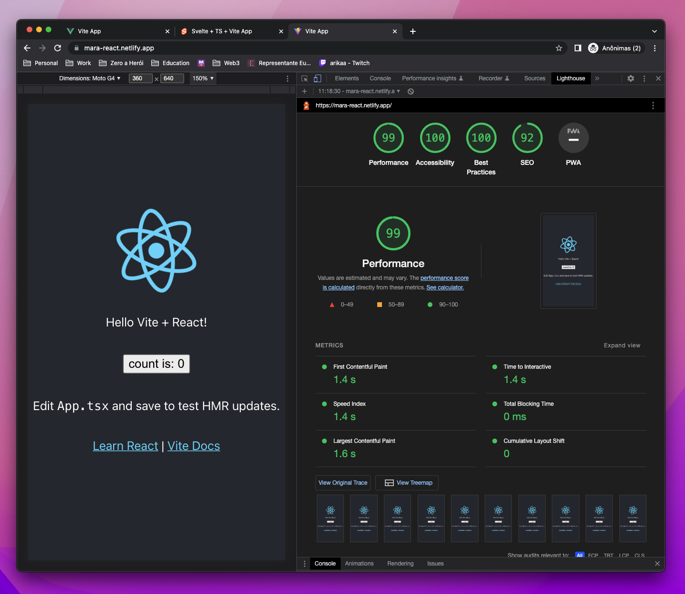
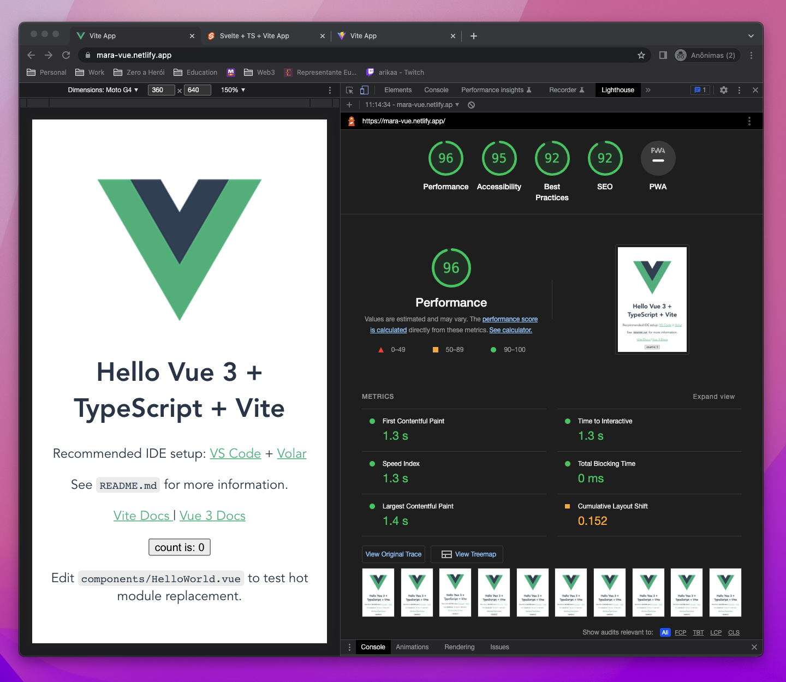
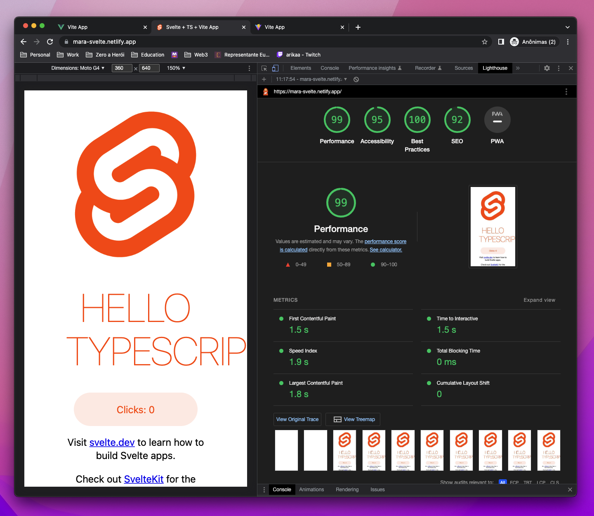
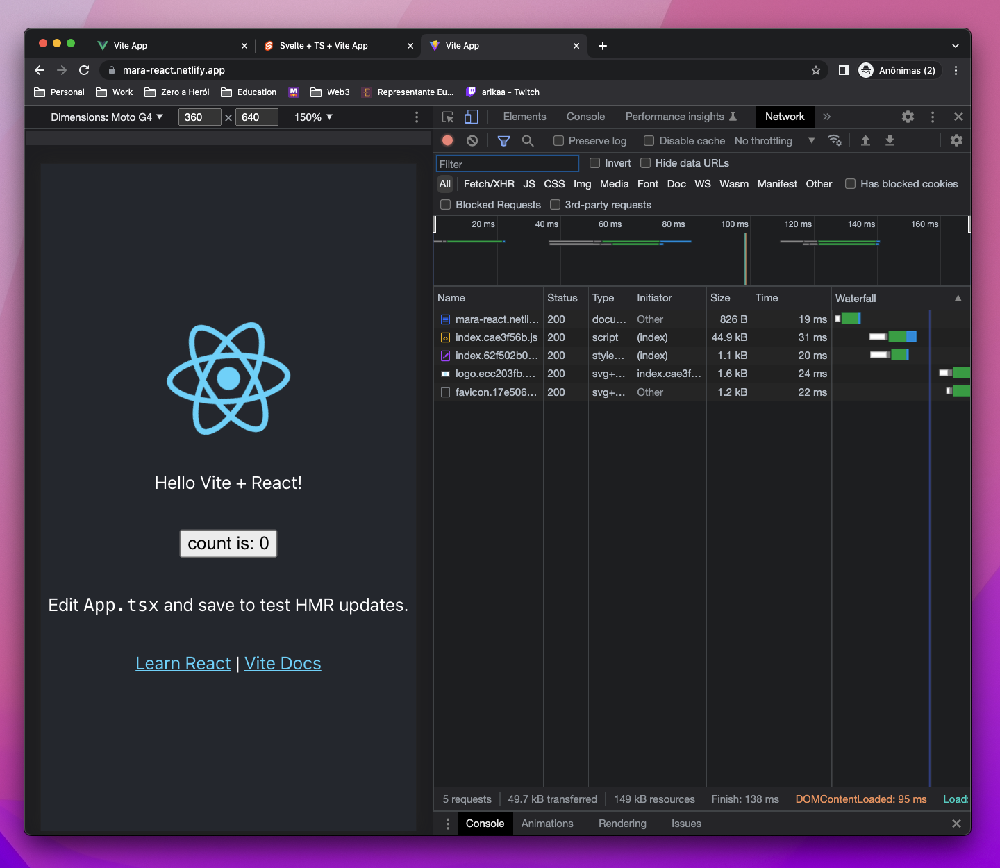
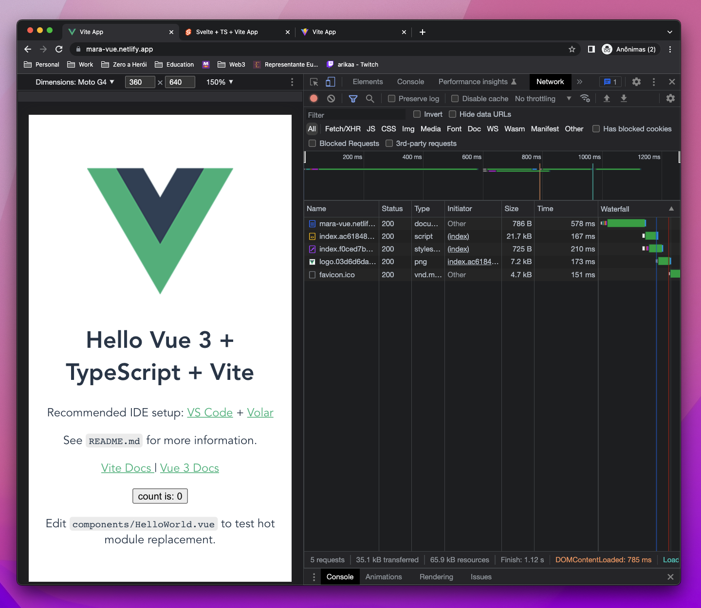
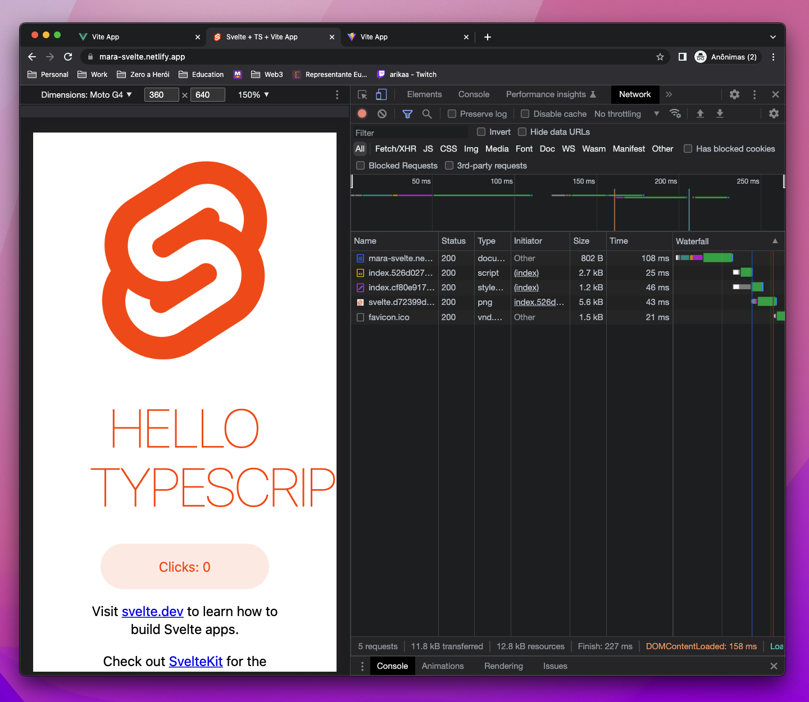

# 🧪 &nbsp; Front-end Frameworks

  

		Este repositório foi criado com o objetivo de conduzir análises de experimentos utilizando os principais frameworks / toolchains para desenvolvimento de front-end disponíveis no mercado: <strong><a href="https://pt-br.reactjs.org/">React</a></strong>, <strong><a href="https://vuejs.org/">Vue</a></strong> e <strong><a href="https://svelte.dev/">Svelte</a></strong>.
  

> Comparação entre os frameworks React, Vue e Svelte.
> Urls das aplicações publicadas no **Netlify**:

-  [Netlify React](https://vinna-react.netlify.app)

-  [Netlify Vue](https://vinna-vue.netlify.app)

-  [Netlify Svelte](https://vinna-svelte.netlify.app)

-  [Netlify Svelte SSR](https://vinna-ssr.netlify.app/)

---

### Sumário

- [Frameworks/Toolchains - Inicialização Padrão](#frameworks-toolchains)
- [React vs Vue vs Svelte - SPA Benchmarking](#spa-benchmarking)
	- [Lighthouse Report](#lighthouse-report)
	- [Network Report](#network-report)

## 🥞 &nbsp; Frameworks/Toolchains - Inicialização Padrão 

Implementação padrão da página de inicialização dos respectivos frameworks, utilizando **vite** e **netlify** como solução de hosting das Single Page Applications.
 

  

  

  

---

## 🏎️ &nbsp; React vs Vue vs Svelte - SPA Benchmarking 

Comparação entre os frameworks React, Vue e Svelte, **mobile-first**, **cache desabilitado** em modo anônimo.

---

### ​ Lighthouse Report 

> Critérios como acessibilidade, melhores práticas e SEO são relativos, uma vez que as páginas de welcome screen implementam boilerplates superficiais.

| Critério          | React  | Vue   | Svelte |
| ----------------- | ------ | ----- | ------ |
| Performance       | 99 🟢  | 96 🔻 | 99 🟢  |
| Acessibilidade    | 100 🟢 | 95 🔻 | 95 🔻  |
| Melhores Práticas | 100 🟢 | 92 🔻 | 100 🟢 |
| SEO               | 92     | 92    | 92     |

    
		 
    
		 
    
		 

### ​ Network Report 

> Recursos como favicon, imagens e CSS foram ignorados por se tratarem de assets adicionais e diferentes entre as welcome screens de cada uma das soluções.

|       Critério (Tamanho)       |   React    |    Vue     |  Svelte   |
| :----------------------------: | :--------: | :--------: | :-------: |
|         Documento HTML         |  826 B 🔻  |  766 B 🟢  | 802 B 🟡  |
|       Javascript Bundle        | 44.9 kB 🔻 | 21.7 kB 🟡 | 2.7 kB 🟢 |
|      Nº de Requisições\*       |     5      |     5      |     5     |
|      Tamanho de Recursos       |  49.7 kB   |  35.1 kB   |  11.8 kB  |
| Tempo de Carregamento do DOM\* |   95 ms    |   785 ms   |  158 ms   |

    
		 
    
		 
    
		 

